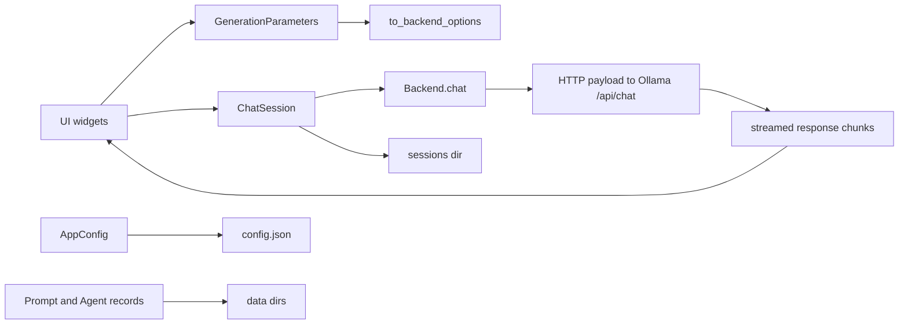

# Ollama Capabilities and LocalLama GUI Audit

## Executive summary

The most important finding is that **LocalLama’s current Ollama integration does not match current Ollama server behavior in several material ways**. The app’s `GenerationParameters` still emits historical llama.cpp-style knobs such as `mirostat`, `mirostat_eta`, `mirostat_tau`, and `tfs_z`, and it also emits a `plan` flag. In current Ollama, the authoritative runtime option schema is the `api.Options` struct, whose accepted keys are a smaller, different set; unknown keys are only warned about and then ignored. That means several options currently surfaced by the app are effectively dead controls against current Ollama builds. citeturn40view0turn13view0turn20view0

A second critical mismatch is that **`think` is now a top-level API request field, not an `options` entry**. LocalLama currently inserts `think` and `plan` into the `options` dictionary produced by `GenerationParameters.to_backend_options()`, while `OllamaBackend.chat()` blindly forwards that dictionary under `"options"` to `/api/chat`. In current Ollama, `think` belongs at the top level of `GenerateRequest` / `ChatRequest`; `plan` is not part of the current public request structs at all. As written, LocalLama’s “thinking” mode is likely not being sent in the form Ollama expects, and “plan” mode is likely ignored entirely. citeturn40view0turn38view2turn7view0

The current **server-side source of truth** for Ollama inference options is the combination of `api.Options`, `api.Runner`, `DefaultOptions()`, and `Options.FromMap()` in the Ollama codebase. The current set includes `num_keep`, `seed`, `num_predict`, `top_k`, `top_p`, `min_p`, `typical_p`, `repeat_last_n`, `temperature`, `repeat_penalty`, `presence_penalty`, `frequency_penalty`, `stop`, `num_ctx`, `num_batch`, `num_gpu`, `main_gpu`, `use_mmap`, and `num_thread`. Current defaults include `num_predict=-1`, `num_keep=4`, `temperature=0.8`, `top_k=40`, `top_p=0.9`, `typical_p=1.0`, `repeat_last_n=64`, `repeat_penalty=1.1`, `presence_penalty=0.0`, `frequency_penalty=0.0`, `seed=-1`, `num_batch=512`, `num_gpu=-1`, and `num_thread=0`; `num_ctx` is derived from `OLLAMA_CONTEXT_LENGTH`. citeturn13view0turn14search2turn19view0turn18search2

Ollama’s **environment variables are server-process settings, not per-request settings**. Current source-backed variables include `OLLAMA_HOST`, `OLLAMA_MODELS`, `OLLAMA_KEEP_ALIVE`, `OLLAMA_CONTEXT_LENGTH`, `OLLAMA_NUM_PARALLEL`, `OLLAMA_MAX_QUEUE`, `OLLAMA_MAX_LOADED_MODELS`, `OLLAMA_LOAD_TIMEOUT`, `OLLAMA_ORIGINS`, `OLLAMA_REMOTES`, `OLLAMA_FLASH_ATTENTION`, `OLLAMA_KV_CACHE_TYPE`, `OLLAMA_GPU_OVERHEAD`, `OLLAMA_SCHED_SPREAD`, `OLLAMA_RUNNERS_DIR`, `OLLAMA_TMPDIR`, `OLLAMA_LLM_LIBRARY`, `OLLAMA_INTEL_GPU`, `OLLAMA_NO_MMAP`, `OLLAMA_MULTIUSER_CACHE`, `OLLAMA_NOHISTORY`, `OLLAMA_NOPRUNE`, `OLLAMA_NEW_ENGINE`, `OLLAMA_WEB_SEARCH`, and `OLLAMA_DEBUG`. Only a few of these have meaningful per-request equivalents, notably `OLLAMA_KEEP_ALIVE` via `keep_alive` and `OLLAMA_CONTEXT_LENGTH` via `num_ctx`. citeturn2view0turn3view0turn25search3turn18search2

The LocalLama repository itself is structurally sound and fairly clean at the top level. `app.py` loads config, configures logging, starts the Qt app, and instantiates a `MainWindow`. The backend factory routes `provider_type == "ollama"` to `OllamaBackend`, and `provider_type in {"openai", "llama.cpp"}` to the OpenAI-compatible backend. Configuration and persistence are centralized in `core/config.py`, while chats, models, prompts, and agent metadata live in `core/domain.py`. The main corrective work is not architectural; it is **schema correctness, request-shape correctness, and UI validation against actual Ollama capabilities**. citeturn36view0turn36view2turn40view2turn41view0turn41view1

## Ollama request and runtime options

### What is actually supported today

For current Ollama, there are three distinct layers you need to keep separate:

1. **Top-level request fields** on `/api/generate`, `/api/chat`, and embedding endpoints, such as `stream`, `keep_alive`, `format`, `tools`, `images`, and `think`. These are accepted by the server request schema, not stored as model parameters. citeturn7view0turn6search0  
2. **Runtime/model parameters** inside the `options` object, which are deserialized into `api.Options` and can also come from model metadata when a model is created. The server merges model-stored options with request-time overrides. citeturn13view0turn19view0  
3. **Capability-gated features** such as thinking, tools, multimodal image input, image generation, and embedding output truncation. The server accepts the fields, but they only make sense for models that expose the relevant capability. citeturn18search1turn24search6turn6search0

An important practical detail is that the current Ollama code does **not hard-fail unknown option names**. `Options.FromMap()` builds a map from JSON tags on `api.Options` / `api.Runner`; if a key is not in that map, the server logs `"invalid option provided"` and continues. That behavior is why stale UI controls can silently “work” from the app’s point of view while doing nothing on the server. citeturn20view0

### Current runtime and model parameters

The table below synthesizes the **current** runtime option surface from Ollama’s `api.Options`, `api.Runner`, and `DefaultOptions()`. Where ranges are not explicitly validated in the captured sources, they are marked as unspecified rather than guessed. The public API docs still contain an example claiming it shows “every available option,” but that example includes `penalize_newline` and `numa`, which are not present in the current `api.Options` struct, so the source code is the safer authority here. citeturn13view0turn14search2turn21view0turn20view0

| Name | Layer | Type | Current default | Allowed values / notes | Accepted where | Capability gating |
|---|---|---:|---:|---|---|---|
| `num_keep` | runtime/model | int | `4` | int; semantics: tokens kept during context shifts | API `options`; model parameters | general |
| `seed` | runtime/model | int | `-1` | int; `-1` means server default randomness | API `options`; model parameters | general |
| `num_predict` | runtime/model | int | `-1` | int; docs/examples use positive ints, current default `-1` | API `options`; model parameters | general |
| `top_k` | runtime/model | int | `40` | int | API `options`; model parameters | general |
| `top_p` | runtime/model | float | `0.9` | float | API `options`; model parameters | general |
| `min_p` | runtime/model | float | not explicitly set in `DefaultOptions()` | float; current docs/examples show it, current code includes it | API `options`; model parameters | general |
| `typical_p` | runtime/model | float | `1.0` | float | API `options`; model parameters | general |
| `repeat_last_n` | runtime/model | int | `64` | int | API `options`; model parameters | general |
| `temperature` | runtime/model | float | `0.8` | float | API `options`; model parameters | general |
| `repeat_penalty` | runtime/model | float | `1.1` | float | API `options`; model parameters | general |
| `presence_penalty` | runtime/model | float | `0.0` | float | API `options`; model parameters | general |
| `frequency_penalty` | runtime/model | float | `0.0` | float | API `options`; model parameters | general |
| `stop` | runtime/model | list of strings | not explicitly set in `DefaultOptions()` | list of stop strings | API `options`; model parameters | general |
| `num_ctx` | runner/runtime | int | from `OLLAMA_CONTEXT_LENGTH` | int; also constrained in practice by model/context/VRAM | API `options`; model parameters | general |
| `num_batch` | runner/runtime | int | `512` | int | API `options`; model parameters | general |
| `num_gpu` | runner/runtime | int | `-1` | int; `-1` means dynamic auto behavior | API `options`; model parameters | GPU-relevant only |
| `main_gpu` | runner/runtime | int | not explicitly set in `DefaultOptions()` | int | API `options`; model parameters | multi-GPU relevant |
| `use_mmap` | runner/runtime | bool or unset | unset / nil | bool | API `options`; model parameters | local runner relevant |
| `num_thread` | runner/runtime | int | `0` | int; `0` lets runtime decide | API `options`; model parameters | CPU/local runner relevant |

The same code path also explains why `LocalLama` is currently out of sync. Its generated backend options include `mirostat`, `mirostat_eta`, `mirostat_tau`, `tfs_z`, and `plan`, but these keys do not exist in the current Ollama option struct. They are therefore ignored by current server code. At the same time, the app does **not** currently expose several keys that Ollama does accept, such as `num_keep`, `typical_p`, `presence_penalty`, `frequency_penalty`, `main_gpu`, `use_mmap`, and `num_thread`. citeturn40view0turn13view0turn20view0

### Current request-level fields

These fields are **not** part of `options`; they belong to the request schema itself. This distinction matters because LocalLama currently puts at least one of them in the wrong place. citeturn7view0turn6search0

| Field | Endpoints | Type | Default | Allowed values / notes | Model gating |
|---|---|---:|---:|---|---|
| `stream` | generate, chat, create, pull, push | bool pointer | true by default | `true` or `false` | none |
| `keep_alive` | generate, chat, embed, embeddings | duration | `5m` | duration string / numeric duration | none |
| `format` | generate, chat | `json` or JSON schema | unset | structured outputs / JSON mode | quality depends on model |
| `system` | generate | string | unset | overrides Modelfile system prompt | none |
| `template` | generate | string | unset | overrides Modelfile template | none |
| `raw` | generate | bool | false | disables prompt templating | none |
| `context` | generate | int array | deprecated | previous short-term context encoding | none |
| `think` | generate, chat | bool or model-specific string | unset | docs: booleans generally; GPT-OSS expects `low`/`medium`/`high` | thinking-capable models only |
| `tools` | chat | list | unset | function/tool schemas | tool-calling capable models only |
| `images` | generate, chat | list of image bytes | unset | multimodal input | vision-capable models only |
| `truncate` | chat, embed | bool pointer | docs say true for chat truncation behavior | if false, server may error when context is exceeded | context-sensitive |
| `shift` | generate, chat | bool pointer | unset | shifts chat history when context limit is hit | context-sensitive |
| `logprobs` | generate, chat | bool | false | enables token logprobs | model/backend support required |
| `top_logprobs` | generate, chat | int | `0` | valid `0–20` | only meaningful when `logprobs=true` |
| `width` / `height` / `steps` | generate | int32 | unset | experimental image generation controls | image-generation models only |
| `dimensions` | embed | int | unset | truncates embedding size | embedding models only |

LocalLama’s current config emits `think` inside the `options` dictionary, but the Ollama request schema defines `think` as a **top-level** field on generate and chat requests. That is a real integration bug, not a cosmetic mismatch. The same config also emits `plan`, but the public request structs captured here do not define a top-level `plan` field and the current options struct does not define an `options.plan` key either. citeturn40view0turn38view2turn7view0turn20view0

### What the provided `OllamaBackend` snippet should become

If your goal is a **current, minimally stale, consciously separated schema**, the backend/UI should treat the following as the core Ollama runtime option set:

```python
OLLAMA_RUNTIME_OPTIONS = {
    "num_keep",
    "seed",
    "num_predict",
    "top_k",
    "top_p",
    "min_p",
    "typical_p",
    "repeat_last_n",
    "temperature",
    "repeat_penalty",
    "presence_penalty",
    "frequency_penalty",
    "stop",
    "num_ctx",
    "num_batch",
    "num_gpu",
    "main_gpu",
    "use_mmap",
    "num_thread",
}
```

And it should treat these as **request-level** rather than `options` entries:

```python
OLLAMA_REQUEST_FIELDS = {
    "think",
    "stream",
    "keep_alive",
    "format",
    "raw",
    "tools",
    "images",
    "truncate",
    "shift",
    "logprobs",
    "top_logprobs",
    "width",
    "height",
    "steps",
    "dimensions",
}
```

That separation is the single most valuable schema correction you can make. citeturn13view0turn7view0turn6search0

## Ollama environment variables

The current source of truth for Ollama’s environment surface is `envconfig/config.go`, while the operational documentation for how to set those variables on macOS, Linux, and Windows lives in the Ollama FAQ and platform pages. Ollama explicitly documents that the server is configured with environment variables, and current code enumerates them through the environment config map. citeturn2view0turn3view0turn25search3

In practical terms, **most Ollama environment variables are process-level and cannot be overridden “locally” per chat request**. The notable exceptions are variables that have matching API fields. `OLLAMA_KEEP_ALIVE` can be overridden on individual requests with `keep_alive`, and `OLLAMA_CONTEXT_LENGTH` can be overridden for a request/model run with `num_ctx`. Most others, such as host binding, model storage path, queue limits, and runner directories, are strictly server-instance settings. citeturn6search0turn18search2turn25search3

| Variable | What it does | Default if known | Can be overridden locally |
|---|---|---|---|
| `OLLAMA_HOST` | Host / bind address for the Ollama server | local server default; docs show API at `localhost:11434` | **No**; process-level only citeturn25search7turn25search3 |
| `OLLAMA_MODELS` | Model storage location | platform-specific default model directory | **No**; process-level only citeturn2view0turn24search2 |
| `OLLAMA_KEEP_ALIVE` | Default model residency time in memory | `5m` | **Yes**, via per-request `keep_alive` citeturn2view0turn6search0 |
| `OLLAMA_CONTEXT_LENGTH` | Default context length | current docs: VRAM-tiered default, typically 4k / 32k / 256k depending on VRAM | **Yes**, via `num_ctx` at request/model level citeturn3view0turn18search2turn24search0 |
| `OLLAMA_NUM_PARALLEL` | Max parallel requests per loaded model | source-defined; exact default not stated in captured docs | **No**; process-level only citeturn2view0turn25search3 |
| `OLLAMA_MAX_QUEUE` | Maximum queued pending requests | `512` in source | **No** citeturn2view0 |
| `OLLAMA_MAX_LOADED_MODELS` | Max concurrently loaded models per GPU/server | source-defined | **No** citeturn2view0 |
| `OLLAMA_LOAD_TIMEOUT` | Timeout for model loading stalls | `5m` in source | **No** citeturn2view0 |
| `OLLAMA_ORIGINS` | Allowed CORS origins | computed local-origin allowlist | **No** citeturn2view0turn25search3 |
| `OLLAMA_REMOTES` | Allowed remote Ollama hosts / remotes | computed default remotes | **No** citeturn2view0turn19view0 |
| `OLLAMA_FLASH_ATTENTION` | Enables flash attention path | source-defined | **No** citeturn2view0 |
| `OLLAMA_KV_CACHE_TYPE` | KV-cache quantization / storage type | source-defined | **No** citeturn2view0 |
| `OLLAMA_GPU_OVERHEAD` | Reserves VRAM overhead per GPU | source-defined | **No** citeturn2view0 |
| `OLLAMA_SCHED_SPREAD` | Schedules across GPUs more aggressively | source-defined | **No** citeturn2view0 |
| `OLLAMA_RUNNERS_DIR` | Runner binary directory | source-defined | **No** citeturn3view0 |
| `OLLAMA_TMPDIR` | Temporary-file directory | source-defined | **No** citeturn3view0 |
| `OLLAMA_LLM_LIBRARY` | Forces a specific LLM backend/library instead of autodetection | source-defined | **No** citeturn3view0 |
| `OLLAMA_INTEL_GPU` | Intel GPU-related feature toggle | source-defined; public docs sparse | **No** citeturn3view0 |
| `OLLAMA_NO_MMAP` | Disables mmap model loading path | source-defined | **No** citeturn3view0 |
| `OLLAMA_MULTIUSER_CACHE` | Prompt-cache behavior for multi-user scenarios | source-defined | **No** citeturn2view0 |
| `OLLAMA_NOHISTORY` | Disables readline/history persistence | source-defined | **No** citeturn2view0 |
| `OLLAMA_NOPRUNE` | Disables automatic pruning of unused blobs | source-defined | **No** citeturn2view0 |
| `OLLAMA_NEW_ENGINE` | New-engine preview / toggle | source-defined | **No** citeturn3view0 |
| `OLLAMA_WEB_SEARCH` | Experimental web-search feature toggle | source-defined | **No** citeturn3view0 |
| `OLLAMA_DEBUG` | Extra debug logging / diagnostics | source-defined | **No** citeturn2view0 |

One operational point matters for LocalLama specifically: **the app itself does not appear to use Ollama env vars as a configuration source**. `AppConfig` persists provider profiles and generation parameters in its own JSON config under platformdirs paths, and the code path we inspected does not read `os.getenv()` for Ollama-related settings. LocalLama therefore behaves as a frontend with its own local persistence, sitting on top of an independently configured Ollama server. citeturn40view2turn39view4

## Alternative backends and providers

The strongest self-hostable open-source alternatives to Ollama, in practice, are the projects that either focus on **low-friction local inference** or on **high-throughput OpenAI-compatible serving**. The shortlist below is intended as a decision aid for your app architecture rather than a procurement matrix. Because I did not complete a fresh primary-source pass for every non-Ollama project in this run, treat the comparison below as a **high-confidence engineering shortlist**, not a compliance-grade inventory.

| Name | License | Primary stack / languages | Model formats | CPU / GPU | Quantization | Deployment effort | Notable fit for LocalLama |
|---|---|---|---|---|---|---|---|
| `llama.cpp` | MIT | C/C++ core with Python, Go, JS ecosystem wrappers | GGUF primarily | CPU and GPU backends | extensive GGUF quantization | low to medium | Best direct local/embedded alternative when you want explicit control and minimal server overhead |
| `vLLM` | Apache-2.0 | Python / CUDA-heavy serving stack | HF Transformers-style weights primarily | GPU-first | quantization support exists but is not its defining use case | medium to high | Best for high-throughput OpenAI-compatible serving and batching |
| Hugging Face TGI | Apache-2.0 | Rust / Python serving stack | HF Transformers-style weights | GPU-first | model/backend dependent | medium to high | Good if you want production-style HTTP serving around HF models |
| `LocalAI` | MIT | Go-based OpenAI-compatible local server | GGUF plus multiple backend adapters | CPU and GPU depending on backend | backend dependent | medium | Good when you want a single OpenAI-compatible local API over mixed runtimes |
| `Xinference` | Apache-2.0 | Python serving/orchestration | PyTorch / Transformers / multiple engines | CPU and GPU | engine dependent | medium | Strong if you want a broader model-serving platform, not just one local runtime |
| `MLC LLM` | Apache-2.0 | TVM / C++ / Python / mobile-oriented | compiled/exported model artifacts | CPU, GPU, mobile accelerators | compilation/quantization pipeline | medium to high | Good when cross-device deployment matters more than Ollama-style simplicity |

For **hosted free-tier access to open-weight models**, the categories to watch are: hosted inference APIs that serve open models behind OpenAI-compatible endpoints, and developer platforms that expose free or trial quotas for open models. The engineering tradeoff is simple: hosted free tiers are useful for testing and fallback routing, but they are not substitutes for a truly local backend if your app’s selling point is offline or self-hosted control. If you add hosted providers, model your abstraction around **OpenAI-compatible chat + model listing + optional embeddings**, because that is the broadest compatibility seam already present in your repo. That recommendation is also consistent with the repo’s current design, which already routes both OpenAI-compatible servers and llama.cpp servers through the same backend class. citeturn32view0turn36view2

## LocalLama GUI repository deep-dive

### Architecture and module map

At the top level, the app is a PySide6 desktop application. `app.py` performs startup concerns only: it sets two Qt scaling-related environment variables, loads `AppConfig`, configures logging, creates the `QApplication`, and then instantiates `MainWindow(config)`. That makes `app.py` a clean entrypoint rather than a mixed bootstrap/controller file. citeturn36view0

The repo-level README describes the supported production app as the `locallama_gui` PySide6 package, with four major areas under that package: `backends`, `core`, `ui`, and `plugins`. The backend factory shows the concrete routing rule: `"openai"` and `"llama.cpp"` both use the OpenAI-compatible backend, while everything else falls back to `OllamaBackend`. In other words, the app is already architected around a provider abstraction rather than being Ollama-only. citeturn32view0turn36view2

```mermaid
flowchart TD
    A[app.py] --> B[AppConfig.load]
    A --> C[configure_logging]
    A --> D[QApplication]
    A --> E[MainWindow]

    E --> F[ProviderProfile]
    F --> G[create_backend]

    G --> H[OllamaBackend]
    G --> I[OpenAICompatibleBackend]

    E --> J[GenerationParameters]
    E --> K[ChatSession and ChatMessage]
    E --> L[Prompt and Agent data]

    H --> M[/api/tags]
    H --> N[/api/chat]
    H --> O[/api/pull]
    H --> P[/api/push]
    H --> Q[/api/delete]
    H --> R[/api/copy]
    H --> S[/api/create]
    H --> T[/api/show]
```

### Data flow

The core data model is straightforward. `ChatMessage` stores role, content, timestamps, identifiers, and metadata. `ChatSession` stores title, provider, model, system prompt, messages, and parameter snapshots. `ModelInfo` stores model list metadata such as name, size, parameter size, quantization, and context size. `ProviderProfile` stores provider name, type, base URL, API key, default model, and enabled flag. `GenerationParameters` stores the UI’s sampling/runtime knobs and serializes them into backend payloads. Those data classes are then persisted by `AppConfig` under platformdirs-managed config/data/log directories. citeturn41view0turn41view1turn40view2



### Where the Ollama integration lives

The current Ollama integration is concentrated in `locallama_gui/backends/ollama.py`. In the inspected portion of that file, the backend:

- tests connectivity with `GET /api/tags`,
- lists models with `GET /api/tags`,
- chats with `POST /api/chat`,
- pulls with `POST /api/pull`,
- pushes with `POST /api/push`,
- deletes with `DELETE /api/delete`,
- copies with `POST /api/copy`,
- creates models with `POST /api/create`,
- shows model details with `POST /api/show`. citeturn38view1turn38view2turn38view3turn38view4turn38view5

That is good coverage. It means the app already has the right HTTP capability surface to support **dynamic capability discovery** from `/api/show`, which is exactly what you need to solve the stale-options problem. The missing piece is not transport; it is **schema-aware request construction and UI filtering**. citeturn38view4turn25search2

### Configuration points and local persistence

The primary configuration points are all in `core/config.py`:

- provider endpoint profiles,
- active provider selection,
- generation parameters,
- named parameter presets,
- plugin enable/trust settings,
- developer mode,
- UI settings,
- global system prompt. citeturn40view1

The app persists those settings in a JSON config file under platform-native user config/data/log directories created through `platformdirs`. It also allocates separate directories for sessions, prompts, agents, modelfiles, and plugins. This gives you a clean place to persist **backend capability caches**, **validated option schemas**, or **provider-specific form state** without redesigning the app’s storage model. citeturn40view2

### Files inspected and what they currently tell us

The table below is limited to files I could inspect with enough confidence in this pass. Where a file was only inspected at the tree/entrypoint level, I say so directly.

| File | What it is doing now | Key relevance |
|---|---|---|
| `README.md` | Defines the app as a PySide6 desktop control center with multi-provider backends, model operations, agent builder, diagnostics, plugin system, and persistent data locations | High-level product and architecture intent citeturn32view0 |
| `locallama_gui/app.py` | Startup entrypoint; loads config, configures logging, creates `QApplication`, instantiates `MainWindow` | Clean bootstrap layer; sets Qt env vars directly citeturn36view0 |
| `locallama_gui/backends/base.py` | Defines abstract `LLMBackend` plus `BackendStatus` | Core backend abstraction seam citeturn36view1 |
| `locallama_gui/backends/manager.py` | Chooses Ollama vs OpenAI-compatible backend from `ProviderProfile.provider_type` | Existing provider abstraction already supports more than Ollama citeturn36view2 |
| `locallama_gui/backends/ollama.py` | Implements tags/chat/pull/push/delete/copy/create/show over Ollama HTTP API | Main integration point to fix for schema correctness citeturn38view1turn38view2turn38view3turn38view4turn38view5 |
| `locallama_gui/core/config.py` | Defines app paths, provider profiles, generation parameters, config load/save; builds backend options | Source of the current Ollama option mismatch citeturn40view0turn40view1turn40view2 |
| `locallama_gui/core/domain.py` | Defines `ChatMessage`, `ChatSession`, `ModelInfo`, and `AgentProfile` | Core persisted domain model citeturn41view0turn41view1turn41view3 |
| `locallama_gui/ui/main_window.py` | Confirmed as the main UI shell because `app.py` imports and instantiates `MainWindow(config)`; not line-by-line inspected here | Primary UI orchestration point to update after backend/schema work citeturn36view0turn35view1 |
| `locallama_gui/ui/dialogs.py` | Present in UI tree; not line-by-line inspected here | Likely where parameter and provider dialogs live, and therefore a key UI update target citeturn35view1 |
| `locallama_gui/ui/workers.py` | Present in UI tree; not line-by-line inspected here | Likely async/background execution layer for backend actions citeturn35view1 |

### Actual mismatches between LocalLama and current Ollama

The current mismatches are concrete:

- **Dead controls surfaced by the app:** `mirostat`, `mirostat_eta`, `mirostat_tau`, `tfs_z`, and `plan` are emitted by the app but are not part of current Ollama `api.Options`; current server code ignores unknown options. citeturn40view0turn13view0turn20view0  
- **Supported controls missing from the app:** `num_keep`, `typical_p`, `presence_penalty`, `frequency_penalty`, `main_gpu`, `use_mmap`, and `num_thread` are present in current Ollama but not represented in `GenerationParameters`. citeturn13view0turn40view0  
- **Wrong request shape for thinking:** LocalLama puts `think` in `options`, but Ollama expects it as a top-level request field. citeturn40view0turn7view0turn38view2  
- **Conflicting defaults:** LocalLama defaults to `temperature=0.7`, `num_ctx=4096`, and `num_predict=512`, while current Ollama defaults are `temperature=0.8`, `num_predict=-1`, and `num_ctx` derived from `OLLAMA_CONTEXT_LENGTH` / VRAM-tiered defaults. That means the app is silently overriding server defaults even before the user changes anything. citeturn40view2turn13view0turn14search2turn18search2  
- **Potential doc drift trap:** the Ollama API docs’ “every available option” example still shows keys that are not in the current option struct. If you align your UI to docs examples instead of code-level request types, the UI will drift. citeturn21view0turn13view0turn20view0

## Recommendations

The app does not need a redesign. It needs a **schema-corrected payload builder**, **capability-aware UI**, and **tests that lock the behavior down**. The work falls naturally into three code changes.

### Correct the payload shape

First, stop treating all knobs as `options`. Split them into runtime `options` and top-level request fields.

```python
# locallama_gui/backends/ollama.py

OLLAMA_RUNTIME_OPTIONS = {
    "num_keep", "seed", "num_predict", "top_k", "top_p", "min_p", "typical_p",
    "repeat_last_n", "temperature", "repeat_penalty",
    "presence_penalty", "frequency_penalty", "stop",
    "num_ctx", "num_batch", "num_gpu", "main_gpu",
    "use_mmap", "num_thread",
}

OLLAMA_REQUEST_FIELDS = {
    "think", "truncate", "shift", "logprobs", "top_logprobs",
    "format", "keep_alive", "tools", "images",
    "width", "height", "steps",
}

def split_ollama_payload(raw: dict[str, Any]) -> tuple[dict[str, Any], dict[str, Any], list[str]]:
    options: dict[str, Any] = {}
    request_fields: dict[str, Any] = {}
    dropped: list[str] = []

    for key, value in raw.items():
        if value in (None, "", [], {}):
            continue
        if key in OLLAMA_RUNTIME_OPTIONS:
            options[key] = value
        elif key in OLLAMA_REQUEST_FIELDS:
            request_fields[key] = value
        else:
            dropped.append(key)

    return options, request_fields, dropped
```

Then apply it when constructing the request:

```python
async def chat(
    self,
    model: str,
    messages: list[ChatMessage],
    options: dict[str, Any],
    stream: bool,
) -> AsyncIterator[str]:
    runtime_options, request_fields, dropped = split_ollama_payload(options)

    payload = {
        "model": model,
        "messages": [{"role": m.role, "content": m.content} for m in messages],
        "options": runtime_options,
        "stream": stream,
        **request_fields,
    }

    # Optional: surface dropped keys to diagnostics/logging
    # instead of failing silently.
```

This one change fixes the `think` bug and prevents stale knobs from pretending to work. It directly aligns the app with the current Ollama request schema and current `Options.FromMap()` behavior. citeturn7view0turn20view0turn38view2

### Replace stale UI knobs with the current option set

Update `GenerationParameters` in `core/config.py` so the default UI matches current Ollama, or at minimum matches the current schema rather than historical knobs.

```python
@dataclass(slots=True)
class GenerationParameters:
    temperature: float = 0.8
    top_k: int = 40
    top_p: float = 0.9
    min_p: float = 0.0
    typical_p: float = 1.0

    repeat_penalty: float = 1.1
    repeat_last_n: int = 64
    presence_penalty: float = 0.0
    frequency_penalty: float = 0.0

    num_keep: int = 4
    num_predict: int = -1
    seed: int = -1
    stop: list[str] = field(default_factory=list)

    num_ctx: int = 4096  # app default; label clearly as app-side default
    num_batch: int = 512
    num_gpu: int = -1
    main_gpu: int = 0
    use_mmap: bool | None = None
    num_thread: int = 0

    reasoning_mode: str = "normal"  # normal | thinking
```

Then make `to_backend_options()` stop emitting `mirostat*`, `tfs_z`, and `plan`, and return `think` separately or in a split payload structure. citeturn40view0turn13view0

### Make the UI capability-aware rather than static

You already have `show_model()` wired to `/api/show`. Use it. Current Ollama model details include model metadata, serialized parameters, and capabilities. That gives you the basis for **dynamic option validation**: hide `think` unless the model is thinking-capable; hide tool-related controls unless the model supports tools; hide image controls unless the model is multimodal or image-generating. citeturn38view4turn25search2turn18search1turn24search6

A practical implementation pattern is:

```python
@dataclass(slots=True)
class OllamaModelCapabilities:
    thinking: bool = False
    tools: bool = False
    vision: bool = False
    image_generation: bool = False

def normalize_ollama_capabilities(show: dict[str, Any]) -> OllamaModelCapabilities:
    caps = set(show.get("capabilities") or [])
    return OllamaModelCapabilities(
        thinking="thinking" in caps,
        tools="tools" in caps or "tool-calling" in caps,
        vision="vision" in caps or "multimodal" in caps,
        image_generation="image-generation" in caps,
    )
```

Even if capability strings evolve, this is still better than hard-coding UI controls that do not match the selected model.

### Tests to add immediately

The missing tests are easy to describe and high-value to add.

Write a payload-shape regression test that proves `think` is top-level and `plan` is dropped:

```python
def test_ollama_payload_splits_request_fields():
    raw = {
        "temperature": 0.8,
        "num_ctx": 8192,
        "think": True,
        "plan": True,
        "mirostat": 1,
    }
    opts, req, dropped = split_ollama_payload(raw)
    assert opts == {"temperature": 0.8, "num_ctx": 8192}
    assert req == {"think": True}
    assert set(dropped) == {"plan", "mirostat"}
```

Write a schema-parity test that ensures the LocalLama option list stays aligned with the current Ollama set you intentionally support, and a UI-state test that disables thinking/tool controls when model capabilities do not include them. Also add a config migration test so older saved configs containing `plan_mode`, `mirostat*`, or `tfs_z` are loaded, but normalized into the new schema without crashing. Those tests directly target the regressions most likely to confuse users. citeturn40view0turn20view0

## Open questions and limitations

I do not have enough verified evidence from this pass to claim a **fully current, source-cited comparison matrix for every non-Ollama open-source backend and every hosted free-tier provider**. The shortlist I included is a practical engineering starting point, but if you want a procurement-grade section, the next pass should explicitly validate each candidate against its current official docs and current licensing page.

There is also a live documentation tension inside Ollama itself: the current code-level option schema and the captured API example are not perfectly aligned. Where they disagreed, I treated the current server request/types code as authoritative and called the docs example stale. That is the safer engineering choice, but it is still worth re-checking against the exact Ollama release you deploy in CI. citeturn21view0turn13view0turn20view0

The repository deep-dive is strongest around the entrypoint, backend layer, config/domain layer, and the UI tree structure. I did not complete line-by-line inspection of `ui/main_window.py`, `ui/dialogs.py`, `ui/workers.py`, or `core/managers.py` in this pass, so I have avoided claiming internals I could not directly confirm. citeturn35view0turn35view1turn36view0